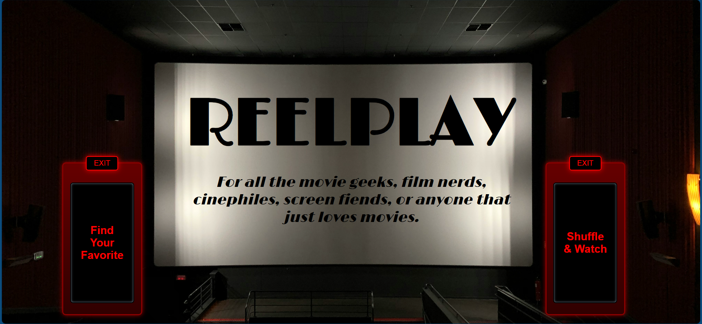
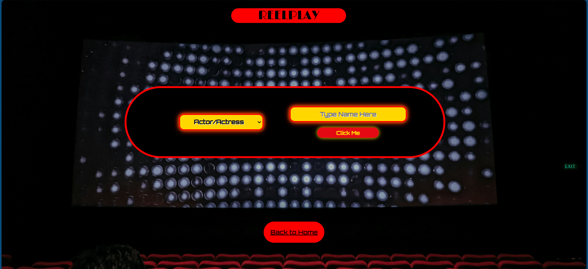
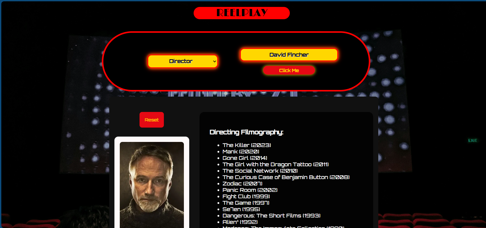
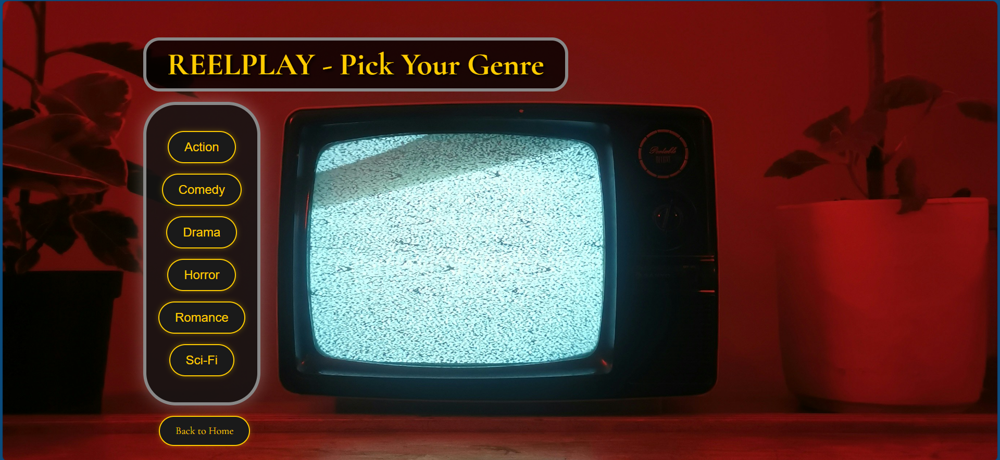
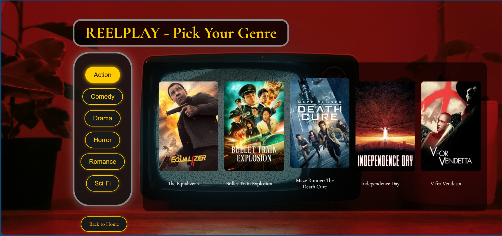

# REELPLAY - For all the movie geeks, film nerds, cinephiles, screen fiends, or anyone that just loves movies.

## Project Overview:
This is a Code:You Web Development Capstone Project. I’ve created a website that lets you search for an actor, director, or screenwriter’s filmography — or pick a genre and get five random movies. 
The site uses The Movie Database (TMDb) API to fetch accurate and up-to-date film data. I built this using HTML, CSS, and JavaScript — combining what I’ve learned in class with what I picked up when 
coding was just a hobby.

I hope you enjoy my little "movie geek" website!

## Project Organization
### Homepage

Users will land here and choose between Find Your Favorite or Shuffle & Watch. The homepage is built with semantic HTML5 elements and CSS style using Flexbox. 
JavaScript is used to add event listeners to the homepage buttons, allowing the user to navigate to either of the pages when clicked.

### Find Your Favorite

This page was also designed using semantic HTML5 and CSS style with Flexbox. Users will select a role (Actor/Actress, Director, or Writer) from the dropdown menu, enter a name into the search bar, click on a
profile photo that appears and then their filmography will show up next to the profile photo. For example, you can search for someone like Ben Affleck who has a filmography for each option. You can choose 
Actor/Actress first, click search and his acting filmography will appear once his photo has been clicked. Switch his role to Director, click search and click the photo, and his directing filmography will appear. 
The same for his screenwriting credits too.


This is an example of what the page will look like when a filmography has been successfuly retrieved. In order to get the profile photo and filmography returned, this page uses a form with JavaScript event 
handling to collect user input and the selected role. Upon submission, it sends a request to the backend, which fetches data from the TMDb API. Results are filtered based on the selected role (Actor, Director, 
Screenwriter), and the relevant profile and filmography are displayed using DOM manipulation. It handles empty inputs, invalid names, and resets the display when new searches are made.

### Shuffle & Watch

This page was also designed using semantic HTML5 and CSS style with Flexbox. Users can select a genre and get 5 completely random movies returned from that genre. Designed for the people who are in the mood for
a certain kind of movie yet cannot decide on something to watch (myself included).


This is an example of what the page will look like when a user has clicked on a genre of their choice and receive five randomly selected movies. When a user clicks a genre button, the frontend sends a request to 
the backend with the selected genre ID. The backend then calls the TMDb “Discover” endpoint using the genre filter to retrieve movies. The backend filters the genre, fetches results, and returns a randomized list 
of 5 movies using Math.random(). These results are dynamically rendered on the page with their poster and title. The frontend dynamically renders these results using DOM manipulation, displaying each movie’s poster 
and title in styled cards.

## Capstone Requirements
1. *Analyze data that is stored in arrays, objects, sets or maps and display information about it in your app* - The filmography data retrieved from the TMDb API is returned as arrays of credits. My backend and frontend both work together to filter and extract the relevant results (cast, directing, screenwriting) based on the selected role. The filtered data is displayed dynamically on the page.
2. *Use a regular expression to validate user input and either prevent the invalid input or inform the user about it (in all cases prevent invalid input from being stored or saved)* - User input for the search form is validated using a regular expression to ensure it contains only valid characters (letters, spaces, dashes, etc). If the input doesn't match the regex, an alert is triggered and the search is prevented, ensuring clean data is sent to the backend.
3. *Create a function that accepts two or more input parameters and returns a value that is calculated or determined by the inputs.  Basic math functions don’t count (e.g. addition, etc)* - I created an async function called getFilmography(personId, roleKey) that accepts a person’s TMDb ID and the selected role (Actor, Director, or Writer). It fetches that person’s filmography, filters the data based on the role, and dynamically displays it. This function includes conditional logic, array filtering, date sorting, and DOM updates based on the input parameters.
4. *Create a node.js web server using a modern framework such as Express.js* - I built a Node.js backend using the Express.js framework. The backend handles routing, forwards search queries to the TMDb API, filters data based on user input, and returns results to the frontend. This also helps protect my API key (which I admittedly kept forgetting about and pushing onto GitHub - a big reason why I moved to a backend) and organize the logic outside of the client-side code.

## Setup
My project isn't deployed live but it can be ran locally in a few easy steps.

### Prerequisites
1. [Node.js](https://nodejs.org) - Make sure Node.js is installed on your computer.
2. A [TMDb API key](https://www.themoviedb.org/documentation/api) is also needed in order to retrieve the necessary data.

### Installation
1. **Clone the repository**
```bash
git clone https://github.com/jrhankins883/WebDev-Capstone-Project
```
2. **Navigate to the backend folder**
```bash
cd backend
```
3. **Install dependencies**
```bash
npm install
```
4. **Create a `.env` file in the `backend` folder with the following:**
```env
APIKEY=your_api_key_here
PORT=3000
```
5. **Start the backend server:**
This project uses [Nodemon](https://github.com/remy/nodemon) during development to automatically restart the server when code changes. If you don’t have Nodemon installed globally, you can use:
```bash
npx nodemon server.js
```
6. **Open the app in your browser:**
Once the backend server is running, open your browser and go to:
```bash
http://localhost:3000
```

## That's a Wrap!
---

Thanks for checking out **REELPLAY**! This project was built as my final capstone project for the Code: You Web Development course. I hope you enjoy exploring it as much as I enjoyed building it!

– John Hankins
